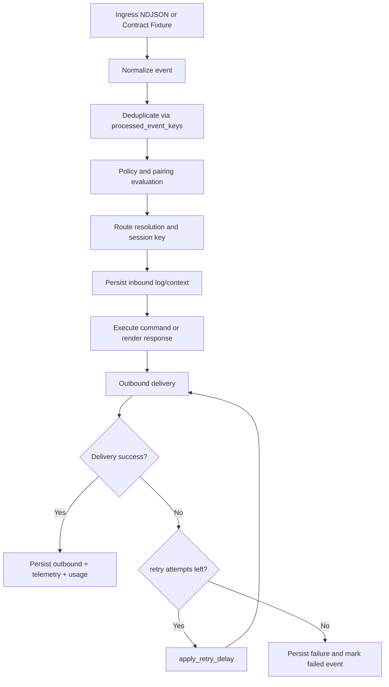
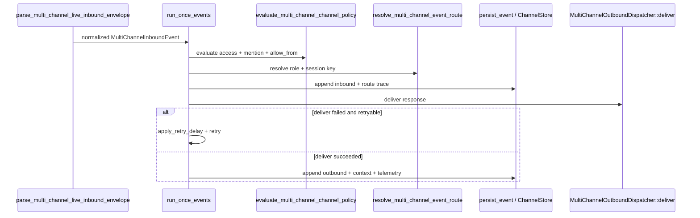

# Multi-channel Event Pipeline

<!-- architecture-doc:multi-channel-event-pipeline -->

This guide documents the runtime flow for multi-channel events (Telegram, Discord, WhatsApp),
including policy, routing, execution, outbound delivery, and retry/failure handling.

Source of truth:

- `crates/tau-multi-channel/src/multi_channel_live_ingress.rs`
- `crates/tau-multi-channel/src/multi_channel_runtime.rs`
- `crates/tau-multi-channel/src/multi_channel_policy.rs`
- `crates/tau-multi-channel/src/multi_channel_routing.rs`
- `crates/tau-multi-channel/src/multi_channel_outbound.rs`

## End-to-end stages

1. Inbound normalization: `parse_multi_channel_live_inbound_envelope`
2. Policy + pairing: `evaluate_multi_channel_channel_policy` + pairing evaluator
3. Routing: `resolve_multi_channel_event_route`
4. Execution/persistence: `persist_event` writes channel-store/log/context state
5. Outbound: `MultiChannelOutboundDispatcher::deliver` in channel-store, dry-run, or provider mode

## Pipeline diagram (with retry/failure paths)



## Sequence view



## Failure and retry semantics

- Dedup: event keys (`transport:event_id`) are skipped if already processed.
- Policy load failure: treated as deny (`deny_channel_policy_load_error`) fail-closed.
- Pairing evaluation failure: treated as deny (`deny_policy_evaluation_error`) fail-closed.
- Delivery failure: appended with `status=delivery_failed`, `reason_code`, `retryable`.
- Retry loop: bounded by `retry_max_attempts`; delay uses `retry_base_delay_ms` + deterministic jitter.

## Runnable validation snippets

```bash
# Pipeline replay from fixture (ingest -> policy -> routing -> persistence)
cargo test -p tau-multi-channel \
  multi_channel_runtime::tests::functional_runner_processes_fixture_and_persists_channel_store_entries

# Retry behavior
cargo test -p tau-multi-channel \
  multi_channel_runtime::tests::integration_runner_retries_transient_failure_then_recovers

# Live ingest normalization and runtime persistence
cargo test -p tau-multi-channel \
  multi_channel_runtime::tests::functional_live_runner_processes_ingress_files_and_persists_state
```

