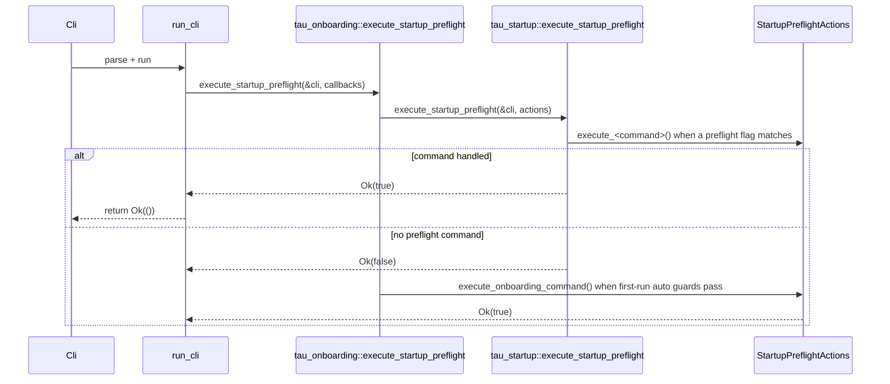
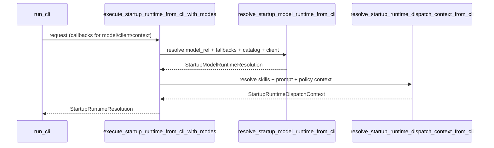
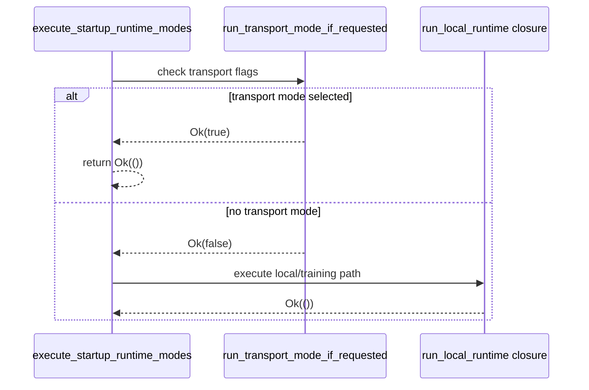

# Startup Dependency Injection Pipeline

<!-- architecture-doc:startup-di -->

This guide documents the startup dependency-injection (DI) path used by Tau runtime entrypoints.

Source of truth:

- `crates/tau-coding-agent/src/startup_dispatch.rs`
- `crates/tau-onboarding/src/startup_dispatch.rs`
- `crates/tau-onboarding/src/startup_preflight.rs`
- `crates/tau-startup/src/lib.rs`

## 3-stage resolution overview

| Stage | Entry API | Primary output |
| --- | --- | --- |
| Stage 1 | `execute_startup_preflight` | Early command handling and short-circuit |
| Stage 2 | `resolve_startup_model_runtime_from_cli` + `resolve_startup_runtime_dispatch_context_from_cli` | `StartupRuntimeResolution` (model, catalog, client, runtime context) |
| Stage 3 | `execute_startup_runtime_modes` | Transport runtime path or local runtime path |

## Stage 1: Preflight command gate

`run_cli` in `tau-coding-agent` calls `execute_startup_preflight` first.  
If any preflight command is selected, startup ends immediately with no model/client boot.

When no explicit preflight command matches, onboarding preflight performs a
first-run auto-wizard check before returning `Ok(false)`. Auto-wizard runs only
when all guards pass:

- `TAU_ONBOARD_AUTO` is not set to `0|false|no|off`
- invocation has no explicit CLI args beyond executable name
- stdin and stdout are TTYs
- first-run state is detected (`profiles.json` and `release-channel.json` absent)



## Stage 2: Dependency and context resolution

When Stage 1 returns `false`, startup builds runtime dependencies in `execute_startup_runtime_from_cli_with_modes`.

Resolution fan-in:

1. Model stack: `resolve_startup_models`, `resolve_startup_model_catalog`, `validate_startup_model_catalog`
2. Client: `build_client_with_fallbacks`
3. Runtime context: `build_startup_runtime_dispatch_context` (skills dir/lock, system prompt, startup policy)

Skills loaded during Stage 2 accept both legacy top-level `.md` files and
directory-based `SKILL.md` files with lightweight frontmatter (`name`,
`description`) and `{baseDir}` placeholder expansion.



## Safety Policy Precedence Contract

Startup safety policy resolution is centralized in `tau-startup`:

- `resolve_startup_safety_policy`
- `startup_safety_policy_precedence_layers`

Canonical precedence layers (lowest to highest override):

1. `profile_preset`
2. `cli_flags_and_cli_env`
3. `runtime_env_overrides`

`tau-onboarding` packages this into startup policy context and passes
`precedence_layers` through runtime dispatch diagnostics.

## Stage 3: Runtime mode dispatch

`execute_startup_runtime_modes` performs the final decision:

1. Try `run_transport_mode_if_requested`
2. If not selected, execute local runtime closure (`run_training_proxy_mode_if_requested`, `run_training_mode_if_requested`, then `run_local_runtime`)



## Validation snippets

```bash
# Stage 1 command short-circuit behavior
cargo test -p tau-onboarding \
  startup_preflight::tests::unit_execute_startup_preflight_onboard_calls_callback

# Stage 1 first-run auto onboarding behavior
cargo test -p tau-onboarding \
  startup_preflight::tests::functional_execute_startup_preflight_auto_runs_onboarding_on_first_run_default_invocation

# Stage 2 model/client/context resolution behavior
cargo test -p tau-onboarding \
  startup_dispatch::tests::unit_resolve_startup_model_runtime_from_cli_returns_composed_outputs

# Stage 3 mode split behavior
cargo test -p tau-onboarding \
  startup_dispatch::tests::functional_execute_startup_runtime_modes_short_circuits_local_when_transport_handles
```
