# Workspace Crate Dependency Graph

- generated_at: `2026-02-21T00:00:00Z`
- metadata_source: `cargo metadata --no-deps --format-version 1`

## Summary

| Metric | Value |
|---|---:|
| workspace_crates | 45 |
| workspace_edges | 198 |

## Mermaid

```mermaid
graph TD
  kamn_core["kamn-core"]
  kamn_sdk["kamn-sdk"]
  tau_access["tau-access"]
  tau_agent_core["tau-agent-core"]
  tau_ai["tau-ai"]
  tau_algorithm["tau-algorithm"]
  tau_browser_automation["tau-browser-automation"]
  tau_cli["tau-cli"]
  tau_coding_agent["tau-coding-agent"]
  tau_contract["tau-contract"]
  tau_core["tau-core"]
  tau_custom_command["tau-custom-command"]
  tau_dashboard["tau-dashboard"]
  tau_dashboard_ui["tau-dashboard-ui"]
  tau_deployment["tau-deployment"]
  tau_diagnostics["tau-diagnostics"]
  tau_discord_runtime["tau-discord-runtime"]
  tau_events["tau-events"]
  tau_extensions["tau-extensions"]
  tau_gateway["tau-gateway"]
  tau_github_issues["tau-github-issues"]
  tau_github_issues_runtime["tau-github-issues-runtime"]
  tau_integration_tests["tau-integration-tests"]
  tau_memory["tau-memory"]
  tau_multi_channel["tau-multi-channel"]
  tau_onboarding["tau-onboarding"]
  tau_ops["tau-ops"]
  tau_orchestrator["tau-orchestrator"]
  tau_provider["tau-provider"]
  tau_release_channel["tau-release-channel"]
  tau_runtime["tau-runtime"]
  tau_safety["tau-safety"]
  tau_session["tau-session"]
  tau_skills["tau-skills"]
  tau_slack_runtime["tau-slack-runtime"]
  tau_startup["tau-startup"]
  tau_tools["tau-tools"]
  tau_trainer["tau-trainer"]
  tau_training_proxy["tau-training-proxy"]
  tau_training_runner["tau-training-runner"]
  tau_training_store["tau-training-store"]
  tau_training_tracer["tau-training-tracer"]
  tau_training_types["tau-training-types"]
  tau_tui["tau-tui"]
  tau_voice["tau-voice"]
  kamn_sdk --> kamn_core
  tau_access --> tau_core
  tau_agent_core --> tau_ai
  tau_agent_core --> tau_memory
  tau_agent_core --> tau_safety
  tau_algorithm --> tau_ai
  tau_algorithm --> tau_trainer
  tau_algorithm --> tau_training_runner
  tau_algorithm --> tau_training_store
  tau_algorithm --> tau_training_tracer
  tau_algorithm --> tau_training_types
  tau_browser_automation --> tau_contract
  tau_browser_automation --> tau_core
  tau_browser_automation --> tau_runtime
  tau_cli --> tau_gateway
  tau_cli --> tau_multi_channel
  tau_cli --> tau_session
  tau_coding_agent --> tau_access
  tau_coding_agent --> tau_agent_core
  tau_coding_agent --> tau_ai
  tau_coding_agent --> tau_algorithm
  tau_coding_agent --> tau_browser_automation
  tau_coding_agent --> tau_cli
  tau_coding_agent --> tau_core
  tau_coding_agent --> tau_custom_command
  tau_coding_agent --> tau_dashboard
  tau_coding_agent --> tau_deployment
  tau_coding_agent --> tau_diagnostics
  tau_coding_agent --> tau_events
  tau_coding_agent --> tau_extensions
  tau_coding_agent --> tau_gateway
  tau_coding_agent --> tau_github_issues
  tau_coding_agent --> tau_github_issues_runtime
  tau_coding_agent --> tau_multi_channel
  tau_coding_agent --> tau_onboarding
  tau_coding_agent --> tau_ops
  tau_coding_agent --> tau_orchestrator
  tau_coding_agent --> tau_provider
  tau_coding_agent --> tau_release_channel
  tau_coding_agent --> tau_runtime
  tau_coding_agent --> tau_session
  tau_coding_agent --> tau_skills
  tau_coding_agent --> tau_slack_runtime
  tau_coding_agent --> tau_startup
  tau_coding_agent --> tau_tools
  tau_coding_agent --> tau_trainer
  tau_coding_agent --> tau_training_proxy
  tau_coding_agent --> tau_training_runner
  tau_coding_agent --> tau_training_store
  tau_coding_agent --> tau_voice
  tau_custom_command --> tau_contract
  tau_custom_command --> tau_core
  tau_custom_command --> tau_runtime
  tau_dashboard --> tau_contract
  tau_dashboard --> tau_core
  tau_dashboard --> tau_runtime
  tau_deployment --> kamn_sdk
  tau_deployment --> tau_cli
  tau_deployment --> tau_contract
  tau_deployment --> tau_core
  tau_deployment --> tau_runtime
  tau_diagnostics --> tau_ai
  tau_diagnostics --> tau_cli
  tau_diagnostics --> tau_core
  tau_diagnostics --> tau_multi_channel
  tau_diagnostics --> tau_provider
  tau_diagnostics --> tau_release_channel
  tau_events --> tau_ai
  tau_events --> tau_cli
  tau_events --> tau_core
  tau_events --> tau_runtime
  tau_extensions --> tau_cli
  tau_extensions --> tau_runtime
  tau_gateway --> tau_agent_core
  tau_gateway --> tau_ai
  tau_gateway --> tau_contract
  tau_gateway --> tau_core
  tau_gateway --> tau_dashboard_ui
  tau_gateway --> tau_memory
  tau_gateway --> tau_multi_channel
  tau_gateway --> tau_runtime
  tau_gateway --> tau_session
  tau_github_issues --> tau_ai
  tau_github_issues --> tau_session
  tau_github_issues_runtime --> tau_access
  tau_github_issues_runtime --> tau_agent_core
  tau_github_issues_runtime --> tau_ai
  tau_github_issues_runtime --> tau_core
  tau_github_issues_runtime --> tau_diagnostics
  tau_github_issues_runtime --> tau_github_issues
  tau_github_issues_runtime --> tau_ops
  tau_github_issues_runtime --> tau_orchestrator
  tau_github_issues_runtime --> tau_provider
  tau_github_issues_runtime --> tau_runtime
  tau_github_issues_runtime --> tau_session
  tau_github_issues_runtime --> tau_startup
  tau_github_issues_runtime --> tau_tools
  tau_integration_tests --> tau_agent_core
  tau_integration_tests --> tau_ai
  tau_integration_tests --> tau_tools
  tau_memory --> tau_contract
  tau_multi_channel --> tau_access
  tau_multi_channel --> tau_contract
  tau_multi_channel --> tau_core
  tau_multi_channel --> tau_orchestrator
  tau_multi_channel --> tau_runtime
  tau_onboarding --> tau_access
  tau_onboarding --> tau_agent_core
  tau_onboarding --> tau_ai
  tau_onboarding --> tau_browser_automation
  tau_onboarding --> tau_cli
  tau_onboarding --> tau_core
  tau_onboarding --> tau_deployment
  tau_onboarding --> tau_diagnostics
  tau_onboarding --> tau_gateway
  tau_onboarding --> tau_multi_channel
  tau_onboarding --> tau_ops
  tau_onboarding --> tau_orchestrator
  tau_onboarding --> tau_provider
  tau_onboarding --> tau_release_channel
  tau_onboarding --> tau_runtime
  tau_onboarding --> tau_skills
  tau_onboarding --> tau_startup
  tau_onboarding --> tau_tools
  tau_onboarding --> tau_voice
  tau_ops --> tau_access
  tau_ops --> tau_ai
  tau_ops --> tau_cli
  tau_ops --> tau_core
  tau_ops --> tau_events
  tau_ops --> tau_multi_channel
  tau_ops --> tau_release_channel
  tau_ops --> tau_runtime
  tau_ops --> tau_session
  tau_orchestrator --> tau_contract
  tau_orchestrator --> tau_core
  tau_orchestrator --> tau_runtime
  tau_provider --> tau_ai
  tau_provider --> tau_cli
  tau_provider --> tau_core
  tau_release_channel --> tau_core
  tau_runtime --> tau_agent_core
  tau_runtime --> tau_ai
  tau_runtime --> tau_core
  tau_runtime --> tau_session
  tau_session --> tau_ai
  tau_session --> tau_core
  tau_skills --> tau_cli
  tau_skills --> tau_core
  tau_slack_runtime --> tau_access
  tau_slack_runtime --> tau_agent_core
  tau_slack_runtime --> tau_ai
  tau_slack_runtime --> tau_core
  tau_slack_runtime --> tau_ops
  tau_slack_runtime --> tau_runtime
  tau_slack_runtime --> tau_session
  tau_slack_runtime --> tau_startup
  tau_slack_runtime --> tau_tools
  tau_startup --> tau_access
  tau_startup --> tau_ai
  tau_startup --> tau_cli
  tau_startup --> tau_core
  tau_startup --> tau_diagnostics
  tau_startup --> tau_events
  tau_startup --> tau_extensions
  tau_startup --> tau_gateway
  tau_startup --> tau_multi_channel
  tau_startup --> tau_provider
  tau_startup --> tau_runtime
  tau_startup --> tau_session
  tau_startup --> tau_tools
  tau_tools --> tau_access
  tau_tools --> tau_agent_core
  tau_tools --> tau_ai
  tau_tools --> tau_cli
  tau_tools --> tau_extensions
  tau_tools --> tau_memory
  tau_tools --> tau_provider
  tau_tools --> tau_runtime
  tau_tools --> tau_session
  tau_trainer --> tau_training_runner
  tau_trainer --> tau_training_store
  tau_trainer --> tau_training_tracer
  tau_trainer --> tau_training_types
  tau_training_proxy --> tau_core
  tau_training_runner --> tau_agent_core
  tau_training_runner --> tau_ai
  tau_training_runner --> tau_training_store
  tau_training_runner --> tau_training_tracer
  tau_training_runner --> tau_training_types
  tau_training_store --> tau_training_types
  tau_training_tracer --> tau_agent_core
  tau_training_tracer --> tau_ai
  tau_training_tracer --> tau_training_store
  tau_training_tracer --> tau_training_types
  tau_voice --> tau_contract
  tau_voice --> tau_core
  tau_voice --> tau_runtime
```

## Workspace Crates

| Crate | Manifest Path |
|---|---|
| kamn-core | `crates/kamn-core/Cargo.toml` |
| kamn-sdk | `crates/kamn-sdk/Cargo.toml` |
| tau-access | `crates/tau-access/Cargo.toml` |
| tau-agent-core | `crates/tau-agent-core/Cargo.toml` |
| tau-ai | `crates/tau-ai/Cargo.toml` |
| tau-algorithm | `crates/tau-algorithm/Cargo.toml` |
| tau-browser-automation | `crates/tau-browser-automation/Cargo.toml` |
| tau-cli | `crates/tau-cli/Cargo.toml` |
| tau-coding-agent | `crates/tau-coding-agent/Cargo.toml` |
| tau-contract | `crates/tau-contract/Cargo.toml` |
| tau-core | `crates/tau-core/Cargo.toml` |
| tau-custom-command | `crates/tau-custom-command/Cargo.toml` |
| tau-dashboard | `crates/tau-dashboard/Cargo.toml` |
| tau-dashboard-ui | `crates/tau-dashboard-ui/Cargo.toml` |
| tau-deployment | `crates/tau-deployment/Cargo.toml` |
| tau-diagnostics | `crates/tau-diagnostics/Cargo.toml` |
| tau-discord-runtime | `crates/tau-discord-runtime/Cargo.toml` |
| tau-events | `crates/tau-events/Cargo.toml` |
| tau-extensions | `crates/tau-extensions/Cargo.toml` |
| tau-gateway | `crates/tau-gateway/Cargo.toml` |
| tau-github-issues | `crates/tau-github-issues/Cargo.toml` |
| tau-github-issues-runtime | `crates/tau-github-issues-runtime/Cargo.toml` |
| tau-integration-tests | `tests/integration/Cargo.toml` |
| tau-memory | `crates/tau-memory/Cargo.toml` |
| tau-multi-channel | `crates/tau-multi-channel/Cargo.toml` |
| tau-onboarding | `crates/tau-onboarding/Cargo.toml` |
| tau-ops | `crates/tau-ops/Cargo.toml` |
| tau-orchestrator | `crates/tau-orchestrator/Cargo.toml` |
| tau-provider | `crates/tau-provider/Cargo.toml` |
| tau-release-channel | `crates/tau-release-channel/Cargo.toml` |
| tau-runtime | `crates/tau-runtime/Cargo.toml` |
| tau-safety | `crates/tau-safety/Cargo.toml` |
| tau-session | `crates/tau-session/Cargo.toml` |
| tau-skills | `crates/tau-skills/Cargo.toml` |
| tau-slack-runtime | `crates/tau-slack-runtime/Cargo.toml` |
| tau-startup | `crates/tau-startup/Cargo.toml` |
| tau-tools | `crates/tau-tools/Cargo.toml` |
| tau-trainer | `crates/tau-trainer/Cargo.toml` |
| tau-training-proxy | `crates/tau-training-proxy/Cargo.toml` |
| tau-training-runner | `crates/tau-training-runner/Cargo.toml` |
| tau-training-store | `crates/tau-training-store/Cargo.toml` |
| tau-training-tracer | `crates/tau-training-tracer/Cargo.toml` |
| tau-training-types | `crates/tau-training-types/Cargo.toml` |
| tau-tui | `crates/tau-tui/Cargo.toml` |
| tau-voice | `crates/tau-voice/Cargo.toml` |

## Workspace Edges

| From | To |
|---|---|
| kamn-sdk | kamn-core |
| tau-access | tau-core |
| tau-agent-core | tau-ai |
| tau-agent-core | tau-memory |
| tau-agent-core | tau-safety |
| tau-algorithm | tau-ai |
| tau-algorithm | tau-trainer |
| tau-algorithm | tau-training-runner |
| tau-algorithm | tau-training-store |
| tau-algorithm | tau-training-tracer |
| tau-algorithm | tau-training-types |
| tau-browser-automation | tau-contract |
| tau-browser-automation | tau-core |
| tau-browser-automation | tau-runtime |
| tau-cli | tau-gateway |
| tau-cli | tau-multi-channel |
| tau-cli | tau-session |
| tau-coding-agent | tau-access |
| tau-coding-agent | tau-agent-core |
| tau-coding-agent | tau-ai |
| tau-coding-agent | tau-algorithm |
| tau-coding-agent | tau-browser-automation |
| tau-coding-agent | tau-cli |
| tau-coding-agent | tau-core |
| tau-coding-agent | tau-custom-command |
| tau-coding-agent | tau-dashboard |
| tau-coding-agent | tau-deployment |
| tau-coding-agent | tau-diagnostics |
| tau-coding-agent | tau-events |
| tau-coding-agent | tau-extensions |
| tau-coding-agent | tau-gateway |
| tau-coding-agent | tau-github-issues |
| tau-coding-agent | tau-github-issues-runtime |
| tau-coding-agent | tau-multi-channel |
| tau-coding-agent | tau-onboarding |
| tau-coding-agent | tau-ops |
| tau-coding-agent | tau-orchestrator |
| tau-coding-agent | tau-provider |
| tau-coding-agent | tau-release-channel |
| tau-coding-agent | tau-runtime |
| tau-coding-agent | tau-session |
| tau-coding-agent | tau-skills |
| tau-coding-agent | tau-slack-runtime |
| tau-coding-agent | tau-startup |
| tau-coding-agent | tau-tools |
| tau-coding-agent | tau-trainer |
| tau-coding-agent | tau-training-proxy |
| tau-coding-agent | tau-training-runner |
| tau-coding-agent | tau-training-store |
| tau-coding-agent | tau-voice |
| tau-custom-command | tau-contract |
| tau-custom-command | tau-core |
| tau-custom-command | tau-runtime |
| tau-dashboard | tau-contract |
| tau-dashboard | tau-core |
| tau-dashboard | tau-runtime |
| tau-deployment | kamn-sdk |
| tau-deployment | tau-cli |
| tau-deployment | tau-contract |
| tau-deployment | tau-core |
| tau-deployment | tau-runtime |
| tau-diagnostics | tau-ai |
| tau-diagnostics | tau-cli |
| tau-diagnostics | tau-core |
| tau-diagnostics | tau-multi-channel |
| tau-diagnostics | tau-provider |
| tau-diagnostics | tau-release-channel |
| tau-events | tau-ai |
| tau-events | tau-cli |
| tau-events | tau-core |
| tau-events | tau-runtime |
| tau-extensions | tau-cli |
| tau-extensions | tau-runtime |
| tau-gateway | tau-agent-core |
| tau-gateway | tau-ai |
| tau-gateway | tau-contract |
| tau-gateway | tau-core |
| tau-gateway | tau-dashboard-ui |
| tau-gateway | tau-memory |
| tau-gateway | tau-multi-channel |
| tau-gateway | tau-runtime |
| tau-gateway | tau-session |
| tau-github-issues | tau-ai |
| tau-github-issues | tau-session |
| tau-github-issues-runtime | tau-access |
| tau-github-issues-runtime | tau-agent-core |
| tau-github-issues-runtime | tau-ai |
| tau-github-issues-runtime | tau-core |
| tau-github-issues-runtime | tau-diagnostics |
| tau-github-issues-runtime | tau-github-issues |
| tau-github-issues-runtime | tau-ops |
| tau-github-issues-runtime | tau-orchestrator |
| tau-github-issues-runtime | tau-provider |
| tau-github-issues-runtime | tau-runtime |
| tau-github-issues-runtime | tau-session |
| tau-github-issues-runtime | tau-startup |
| tau-github-issues-runtime | tau-tools |
| tau-integration-tests | tau-agent-core |
| tau-integration-tests | tau-ai |
| tau-integration-tests | tau-tools |
| tau-memory | tau-contract |
| tau-multi-channel | tau-access |
| tau-multi-channel | tau-contract |
| tau-multi-channel | tau-core |
| tau-multi-channel | tau-orchestrator |
| tau-multi-channel | tau-runtime |
| tau-onboarding | tau-access |
| tau-onboarding | tau-agent-core |
| tau-onboarding | tau-ai |
| tau-onboarding | tau-browser-automation |
| tau-onboarding | tau-cli |
| tau-onboarding | tau-core |
| tau-onboarding | tau-deployment |
| tau-onboarding | tau-diagnostics |
| tau-onboarding | tau-gateway |
| tau-onboarding | tau-multi-channel |
| tau-onboarding | tau-ops |
| tau-onboarding | tau-orchestrator |
| tau-onboarding | tau-provider |
| tau-onboarding | tau-release-channel |
| tau-onboarding | tau-runtime |
| tau-onboarding | tau-skills |
| tau-onboarding | tau-startup |
| tau-onboarding | tau-tools |
| tau-onboarding | tau-voice |
| tau-ops | tau-access |
| tau-ops | tau-ai |
| tau-ops | tau-cli |
| tau-ops | tau-core |
| tau-ops | tau-events |
| tau-ops | tau-multi-channel |
| tau-ops | tau-release-channel |
| tau-ops | tau-runtime |
| tau-ops | tau-session |
| tau-orchestrator | tau-contract |
| tau-orchestrator | tau-core |
| tau-orchestrator | tau-runtime |
| tau-provider | tau-ai |
| tau-provider | tau-cli |
| tau-provider | tau-core |
| tau-release-channel | tau-core |
| tau-runtime | tau-agent-core |
| tau-runtime | tau-ai |
| tau-runtime | tau-core |
| tau-runtime | tau-session |
| tau-session | tau-ai |
| tau-session | tau-core |
| tau-skills | tau-cli |
| tau-skills | tau-core |
| tau-slack-runtime | tau-access |
| tau-slack-runtime | tau-agent-core |
| tau-slack-runtime | tau-ai |
| tau-slack-runtime | tau-core |
| tau-slack-runtime | tau-ops |
| tau-slack-runtime | tau-runtime |
| tau-slack-runtime | tau-session |
| tau-slack-runtime | tau-startup |
| tau-slack-runtime | tau-tools |
| tau-startup | tau-access |
| tau-startup | tau-ai |
| tau-startup | tau-cli |
| tau-startup | tau-core |
| tau-startup | tau-diagnostics |
| tau-startup | tau-events |
| tau-startup | tau-extensions |
| tau-startup | tau-gateway |
| tau-startup | tau-multi-channel |
| tau-startup | tau-provider |
| tau-startup | tau-runtime |
| tau-startup | tau-session |
| tau-startup | tau-tools |
| tau-tools | tau-access |
| tau-tools | tau-agent-core |
| tau-tools | tau-ai |
| tau-tools | tau-cli |
| tau-tools | tau-extensions |
| tau-tools | tau-memory |
| tau-tools | tau-provider |
| tau-tools | tau-runtime |
| tau-tools | tau-session |
| tau-trainer | tau-training-runner |
| tau-trainer | tau-training-store |
| tau-trainer | tau-training-tracer |
| tau-trainer | tau-training-types |
| tau-training-proxy | tau-core |
| tau-training-runner | tau-agent-core |
| tau-training-runner | tau-ai |
| tau-training-runner | tau-training-store |
| tau-training-runner | tau-training-tracer |
| tau-training-runner | tau-training-types |
| tau-training-store | tau-training-types |
| tau-training-tracer | tau-agent-core |
| tau-training-tracer | tau-ai |
| tau-training-tracer | tau-training-store |
| tau-training-tracer | tau-training-types |
| tau-voice | tau-contract |
| tau-voice | tau-core |
| tau-voice | tau-runtime |
